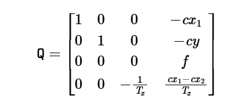
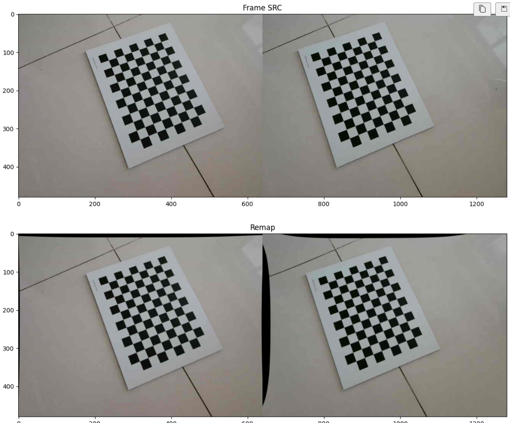
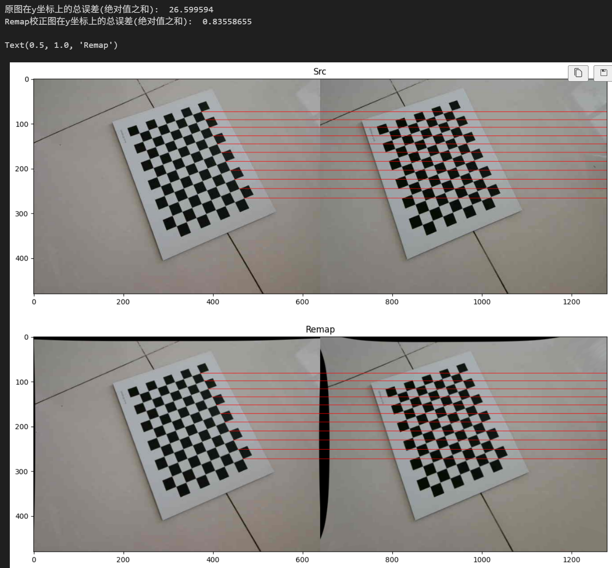
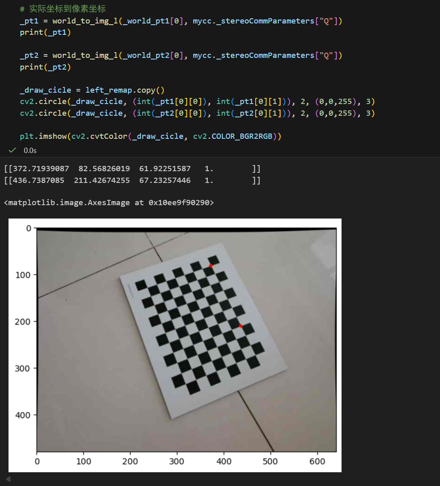
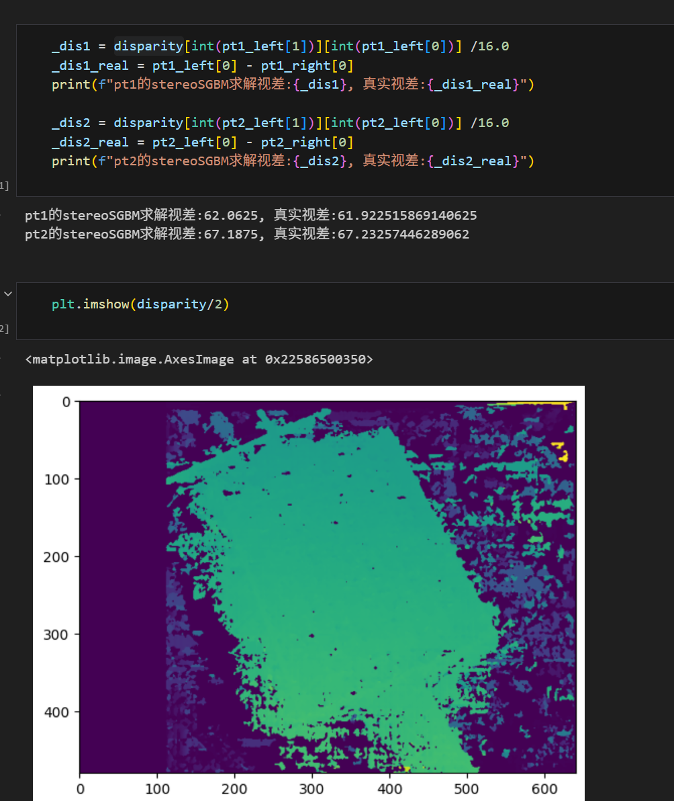

# 立体标定流程

python版本：3.12、包列表：requirements_calibration.txt

## 文件形式说明

使用左右图合并的图像进行标定，左图的物体应该比右图物体更靠右侧，可参考 stereo\calibration\images_640x480 下的图像

## 标定脚本步骤说明

标定脚本：stereo\calibration\calibra.ipynb

### 设置文件路径

建议将标定板的长边设为 col，使用棋盘格标定板

```
# 标定板参数
chessSize=[11, 8] # col, row, 长边设置为col, 短边row , col作为x轴， row作为y轴
chessCellLen=20 # 单位 mm
```

### 标定

```
#相机标定类
mycc = CCameraCalibration()  #初始化
mycc.set_calibration_images(images_path, 15, 480, 1280, size=chessSize, length=chessCellLen) #设置标定图像的路径和图片数量
mycc.stereo_calibration(True, reversal=False) #进行双目立体标定，得到内参矩阵、畸变系数、重映射矩阵map、重投影矩阵Q等
mycc.print_p()
```

打印如下：

```
you have calibrated !
左图对应相机的内参..................................
[[338.65445417   0.         294.63245868]
 [  0.         338.79315821 235.99560417]
 [  0.           0.           1.        ]]

右图对应相机的内参..................................
[[338.19616913   0.         279.11848074]
 [  0.         338.04469341 231.75555723]
 [  0.           0.           1.        ]]

重投影矩阵Q..................................
[[ 1.00000000e+00  0.00000000e+00  0.00000000e+00 -2.93751724e+02]
 [ 0.00000000e+00  1.00000000e+00  0.00000000e+00 -2.42089602e+02]
 [ 0.00000000e+00  0.00000000e+00  0.00000000e+00  3.38418926e+02]
 [ 0.00000000e+00  0.00000000e+00  1.65904301e-02 -0.00000000e+00]]
```

注意重投影矩阵Q最后一行第三列的参数, 官方给出：



你可以调整 mycc.stereo_calibration(True, reversal=False) 里面的 reversal 参数为 True 来使其为负值，这只带来符号上的差别，两者都可以正确参与后续计算。

### 批量生成校正图

```
# 批量生成校正图，以给其它算法使用, 包括 merge、left、right
if False:
    _valid_extensions = {'.jpg', '.png', '.bmp', '.jpeg', '.gif'}
    _image_files = []
```

调整为 True 可以生成立体校正后的左右图和合并图，可用于其它视差算法的验证。

### 立体校正效果浏览

```
# 立体校正
img_src = cv2.imread('./images_640x480/WIN_20251207_14_54_12_Pro.jpg')
print("图像形状:", img_src.shape)
_height, _width, _c = img_src.shape
....
```




### 极线校正检验

运行到
这可以验证极线校正的误差

```
# 绘制水平线，挑选长边竖直的图像绘制
## 原图
_draw_src = img_src.copy()
_width = _draw_src.shape[1]
_points_src_left = left_src_corners[:chessSize[0],:,:] # shape: (col 1 2)
_points_src_right = right_src_corners[:chessSize[0],:,:] # shape: (col 1 2)

_src_error = 0.0
for _point_left, _point_right in zip(_points_src_left, _points_src_right):
    _pt1 = (int(_point_left[0][0]), int(_point_left[0][1]))
    _pt2 = (_width-1, int(_point_left[0][1]))
..........
```



### 像素坐标到实际坐标检验


### 验证实际坐标到像素坐标



### 使用 SGBM 立体匹配




# S2M2 使用

## 使用 onnx 推理

01_s2m2_infer_onnx.ipynb 加载 onnx_models 下的模型推理

## 导出 onnx

```
python ./export_onnx.py --model_type S --img_width 640 --img_height 480
```

模型路径、图片路径在 export_onnx.py 里面修改

## pytorch 推理

使用 visualize_2d_simple.py

模型路径、图片路径在 visualize_2d_simple.py 里面修改


# FoundationStereo使用
参考：https://github.com/NVlabs/FoundationStereo/tree/master?tab=readme-ov-file

```
conda env create -f environment.yml
conda run -n foundation_stereo pip install flash-attn
conda activate foundation_stereo
```


cpu 使用安装 requirements_fds.txt 即可


模型参考官网下载即可

## 快速验证

使用之前得到的校正图像快速验证

先安装必要包：

```
pip install -r requirements_fds.txt
```

切换到 stereo\foundation_stereo 目录
```
python fds_stereo_infer.py --left_file ../calibration/imgs_left_rectify/WIN_20251207_14_54_12_Pro.png --right_file ../calibration/imgs_right_rectify/WIN_20251207_14_54_12_Pro.png --ckpt_dir ../../../pretrained_models/23-51-11/model_best_bp2.pth --out_dir ./test_outputs/
```

视差图被保存到 test_outputs\disp.npy


使用 fds_stereo_quick_verify.ipynb 脚本验证视差的正确性。


## pytorch 推理

使用 fds_stereo_infer.ipynb 进行全流程推理

## 导出 onnx

使用 make_onnx.py 脚本

```
python make_onnx.py --save_path ./pretrained_models/foundation_stereo_small.onnx --ckpt_dir ../../../pretrained_models/11-33-40/model_best_bp2.pth --height 480 --width 640 --valid_iters 20
```

## 使用 onnx

使用 fds_stereo_onnx_infer.ipynb 进行推理

info_onnx.ipynb 用于打印模型输入输出信息


